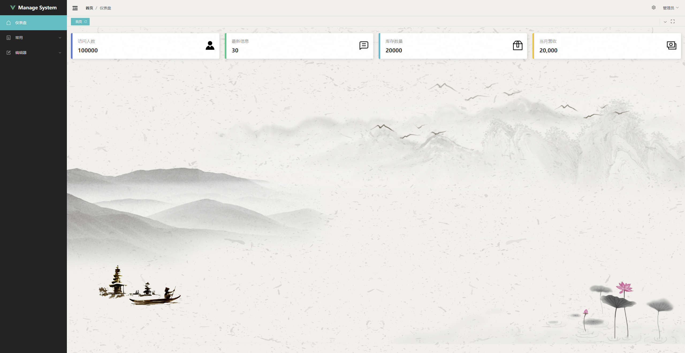
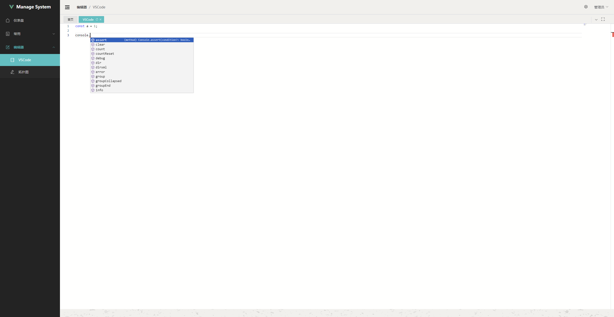
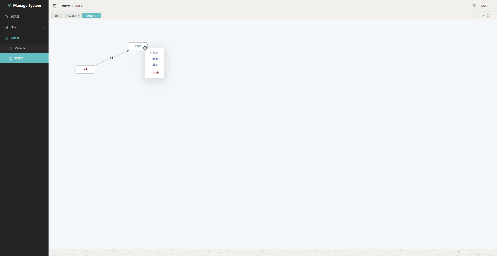

# 简介

forked from: [vue-admin-box](https://github.com/cmdparkour/vue-admin-box) which branch is [template-js](https://github.com/cmdparkour/vue-admin-box/tree/template-js).

Vue 3.4 + Vite 5.4 + Vuex 4.1 + ElementPlus + JavaScript

学习Vue3，精简了原项目的一些配置，更新了依赖，修正了一些错误。

添加常用的组件，如markdown编辑器vditor、富文本编辑器wangEditor、图编辑器antv x6、代码编辑器monaco-editor等。

# 安装

```shell
pnpm install
pnpm run dev
```

# 预览






