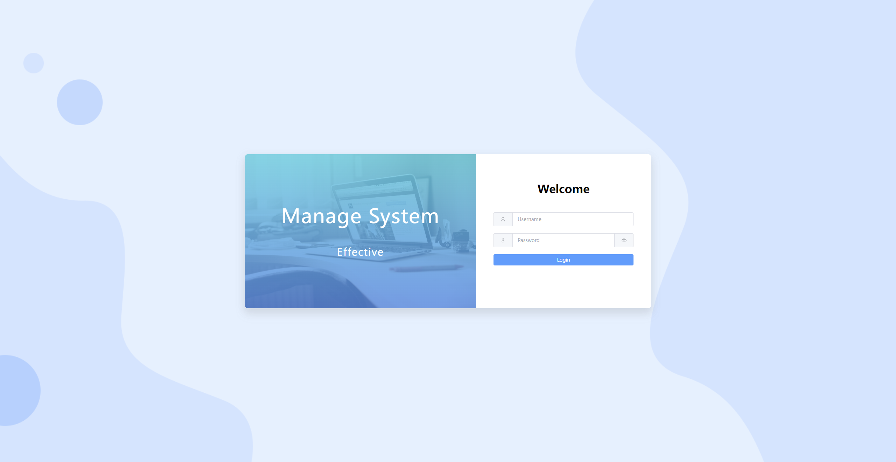

# 简介

Vue 3 + Vite 5 + Pinia 2 + ElementPlus 2 + JavaScript

一款简洁的后台管理系统，添加常用的组件，如markdown编辑器vditor、富文本编辑器wangEditor、图编辑器antv x6、代码编辑器monaco-editor等。

# 安装

```shell
pnpm install
pnpm run dev
```

# 预览




# License

vue-admin-box 1.x, which was forked from: [vue-admin-box](https://github.com/cmdparkour/vue-admin-box) which branch is [template-js](https://github.com/cmdparkour/vue-admin-box/tree/template-js).

Vue3-admin-box 2.x, I fixed some bugs and tried upgrading with some new components.
